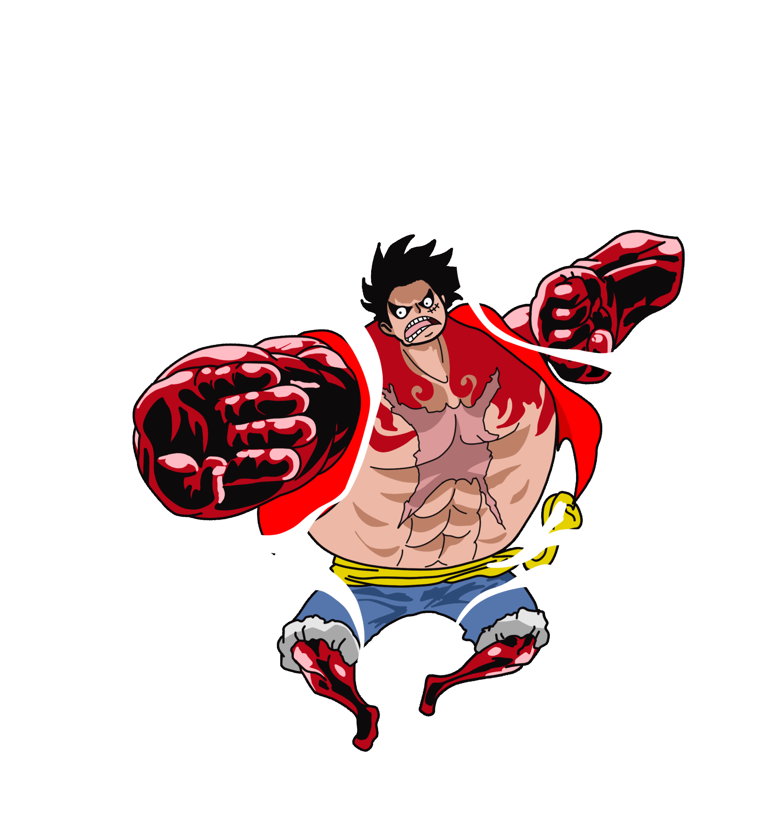

<!-- ==================== HERO ==================== -->

<!-- Animated tagline -->

 

<!-- Quick badges -->

&nbsp;

  

 

<!-- ==================== GITHUB STATISTICS ==================== -->

<h2>📊 GitHub Statistics</h2>

 

 

<!-- ==================== CONTRIBUTION SNAKE ==================== -->

<h2>🐍 Contribution Snake</h2>
 

<picture>
  <source media="(prefers-color-scheme: dark)" srcset="https://raw.githubusercontent.com/aestheticwolf/aestheticwolf/output/github-contribution-grid-snake-dark.svg" />
  <source media="(prefers-color-scheme: light)" srcset="https://raw.githubusercontent.com/aestheticwolf/aestheticwolf/output/github-contribution-grid-snake.svg" />
  
</picture>

 

<!-- ==================== CONNECT ==================== -->

<h2>🌐 Connect With Me</h2>

 

&nbsp;&nbsp;

<!-- ==================== FOOTER ==================== -->

<h3>🚀 Build • Learn • Improve</h3>

 

